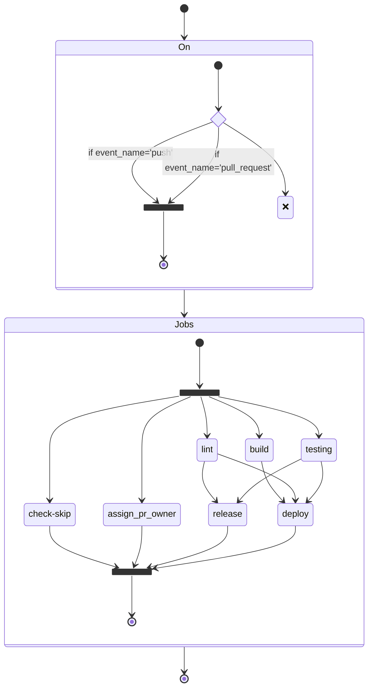

# CI
## Workflow

```mermaid
stateDiagram-v2
  [*] --> On
  State On {
    state on_push_if_state <<choice>>
    state on_fork_state <<fork>>
    [*] --> on_push_if_state  
    on_push_if_state --> on_fork_state : if event_name='push'
    on_push_if_state --> on_fork_state : if event_name='pull_request'
    on_push_if_state --> ❌
    on_fork_state --> [*]
  }
  On --> Jobs
  State Jobs {
    state jobs_fork_state_start <<fork>>
    state jobs_fork_state_end <<fork>>
    
    [*] --> jobs_fork_state_start
    
    jobs_fork_state_start --> check_skip
    check_skip: check-skip
    jobs_fork_state_start --> assign_pr_owner
    jobs_fork_state_start --> build
    jobs_fork_state_start --> lint
    jobs_fork_state_start --> testing
    
    build --> deploy
    lint --> release
    lint --> deploy
    testing --> release
    testing --> deploy
    
    check_skip --> jobs_fork_state_end
    assign_pr_owner --> jobs_fork_state_end
    release --> jobs_fork_state_end
    deploy --> jobs_fork_state_end
    
    jobs_fork_state_end --> [*]
  }
  Jobs --> [*]
```
