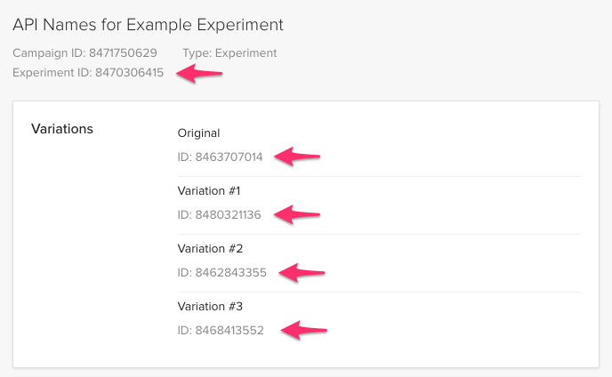

# @s-ui/abtesting-optimizely-x
> A React component that renders one single variation according to OptimizelyX's experiment decision.

```html
<OptimizelyExperiment experimentId={100}>
  <button variationId={1001} defaultVariation>Original</button>
  <button variationId={1002}>Variation #1</button>
  <button variationId={1003}>Variation #2</button>
</OptimizelyExperiment>
```

## Installation

```sh
npm install @s-ui/abtesting-optimizely-x --save
```

## Usage

### 1. Get experiment's id and its variation ids from OptimizelyX

Navigate to: https://app.optimizely.com/v2/ **>** Edit Experiment **>** API Names



### 2. Create your variations and assign its respective ids as below

```javascript
import OptimizelyXExperiment from '@s-ui/abtesting-optimizely-x'
```
```html
<OptimizelyXExperiment experimentId={8470306415}>
  <button variationId={8463707014} defaultVariation>Original</button>
  <button variationId={8480321136}>Variation #1</button>
  <button variationId={8462843355}>Variation #2</button>
  <button variationId={8468413552}>Variation #3</button>
</OptimizelyXExperiment>
```

Component will obtain OptimizelyX's decision for given `experimentId` and display chosen variation.

If no variation is provided or OptimizelyX API is unavailable, `defaultVariation` will be displayed.

## Known issues


### Clipping of variations

[OptimizelyX web API](https://developers.optimizely.com/x/solutions/javascript/introduction/index.html) is used to obtain the decision, not the [fullstack one](https://developers.optimizely.com/x/solutions/sdks/introduction/index.html?language=node). It means that on server side rendering, the default variation will be rendered as Optimizely is not available. Then, when component re-renders on browser, the decided variation will be displayed. So, user may experience some clipping, which could alter test results...

Moreover, depending on how you load Optimizely's snippet, the clipping may also happend in SPA mode (without SSR):
* If you load the snippet as blocking script in `<head>` (recommended by Optimizely itself), no clipping should appear on SPA, as Optimizely will be present on first render.
* If you load Optimizely later (async), the default variation will be rendered on first render. The component will wait for Optimizely until it's loaded (5 seconds max) and then render the decided variation. In that case, user may also experience some clipping.
