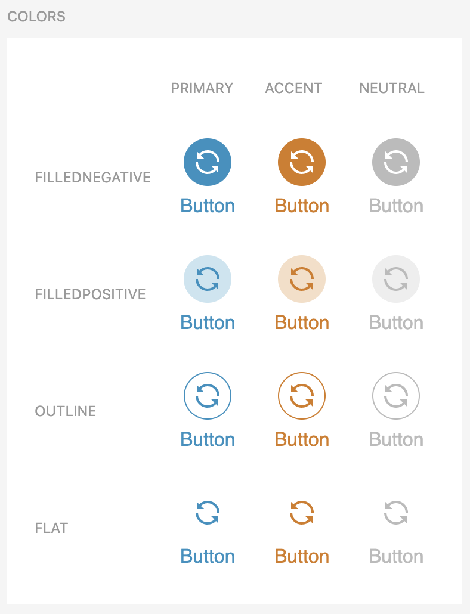
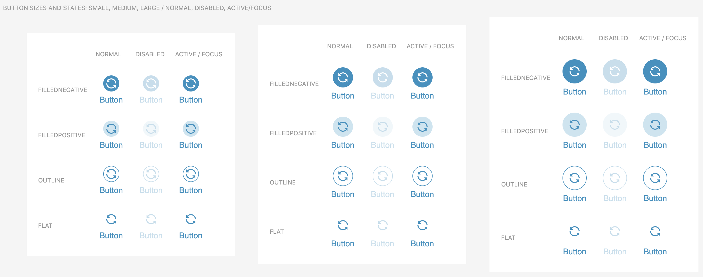

# AtomActionButton

SUI Atom ActionButton




## Installation

```sh
$ npm install @s-ui/react-atom-action-button
```

## Usage

### Basic usage

```js
import AtomActionButton from '@s-ui/react-action-atom-button'

const Icon = () => {
  return (
    <svg viewBox="0 0 24 24" xmlns="http://www.w3.org/2000/svg"><path d="m6.3506 6.3506 2.649 2.649h-6v-6l1.938 1.938c1.842-1.849 4.347-2.938 7.062-2.938 5.515 0 10 4.486 10 10h-2c0-4.411-3.588-8-8-8-2.172 0-4.176.872-5.649 2.351zm11.2988 11.2988-2.649-2.649h6v6l-1.938-1.939c-1.842 1.85-4.347 2.939-7.062 2.939-5.515 0-10-4.486-10-10h2c0 4.411 3.588 8 8 8 2.172 0 4.176-.872 5.649-2.351z" /></svg>
  )
}

return (<div>
  <AtomActionButton icon={Icon}>Normal</AtomActionButton>
  <AtomActionButton icon={Icon} focused>Focused</AtomActionButton>
  <AtomActionButton icon={Icon} size='large' disabled>Disabled, Large</AtomActionButton>
</div>)

```

#### Import package and use the component

```js
import AtomActionButton from '@s-ui/react-atom-action-button'

const Icon = () => {
  return (
    <svg viewBox="0 0 24 24" xmlns="http://www.w3.org/2000/svg"><path d="m6.3506 6.3506 2.649 2.649h-6v-6l1.938 1.938c1.842-1.849 4.347-2.938 7.062-2.938 5.515 0 10 4.486 10 10h-2c0-4.411-3.588-8-8-8-2.172 0-4.176.872-5.649 2.351zm11.2988 11.2988-2.649-2.649h6v6l-1.938-1.939c-1.842 1.85-4.347 2.939-7.062 2.939-5.515 0-10-4.486-10-10h2c0 4.411 3.588 8 8 8 2.172 0 4.176-.872 5.649-2.351z" /></svg>
  )
}

return (<AtomActionButton icon={Icon} />)
```

#### Import the styles (Sass)

```css
@import '~@s-ui/theme/lib/index';
// @import 'your theme';
@import '~@s-ui/react-atom-action-button/lib/index';
```


> **Find full description and more examples in the [demo page](#).**