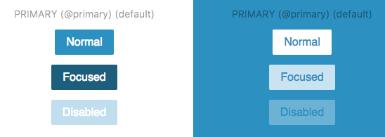

# Button

> Atom Element: SUI button



## Installation

```sh
$ npm install @schibstedspain/sui-atom-button --save
```

## Usage

### Basic usage

```js
import Button from '@schibstedspain/sui-atom-button'

return (<div>
  <Button>Normal</Button>
  <Button focused>Focused</Button>
  <Button size='large' disabled>Disabled</Button>
</div>)

```

### Flexible props

All props available from regular buttons can be used.

```js
import Button from '@schibstedspain/sui-atom-button'

return (<div>
  <Button onClick={() => alert('Primary with onClick')}>
    Primary with onClick
  </Button>
  <Button type='accent' title="Title: Lorem Ipsum">
    Accent with title
  </Button>
  <Button type='secondary' className='customClass'>
    Secondary with className
  </Button>
</div>)

```

### Rendering a link
When `link` property is passed, the component will render an html link.

```js
import Button from '@schibstedspain/sui-atom-button'

return (
  <Button link href='http://www.schibsted.com/' target='_blank'>Link</Button>
)

```

output:

```html
<a class="sui-AtomButton sui-AtomButton--link" href="http://www.schibsted.com/" target='_blank'>Link</a>
```

> **Find full description and more examples in the [demo page](https://sui-components.now.sh/workbench/atom/button).**
