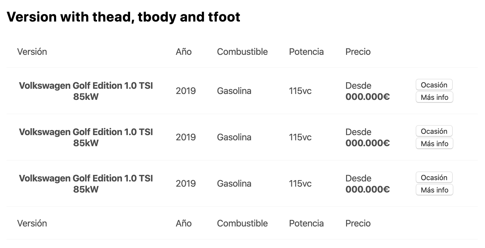

# AtomTable

> Atom Table to show tabular information.



## Installation

```sh
$ npm install @s-ui/react-atom-table --save
```

## Usage

### Basic usage

#### CSS

```scss
@import '@s-ui/react-atom-table/lib/index';
```

#### Javascript

```js
import AtomTable from '@s-ui/react-atom-table'

const contentHead = [
  'Versión',
  'Año',
  'Combustible',
  'Potencia',
  'Precio',
  ''
]

const contentBody = [
  [
    {
      content: 'Volkswagen Golf Edition 1.0 TSI 85kW',
      type: 'th',
      isNowrap: true
    },
    {content: '2019'},
    {content: 'Gasolina'},
    {content: '115vc'},
    {content: 'Desde 24.000€'},
    {content: 'Más información'}
  ],
  [
    {
      content: 'Volkswagen Golf Edition 1.0 TSI 85kW',
      type: 'th',
      isNowrap: true
    },
    {content: '2019'},
    {content: 'Gasolina'},
    {content: '115vc'},
    {content: 'Desde 24.000€'},
    {content: 'Más información'}
  ]
]

return <AtomTable head={contentHead} body={contentBody} />


> **Find full description and more examples in the [demo page](#).**
```
