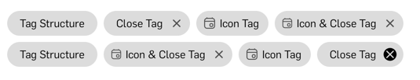

# AtomTag

> Atom Element: SUI Tag



## Installation

```sh
npm install @s-ui/react-atom-tag --save
```

## Usage

```js
import AtomTag from '@s-ui/react-atom-tag'

<AtomTag
  label='Tag Structure'
/>

<AtomTag
  label='Navigation Tag'
  onClick={() => alert('click!')}
/>
```

### Tag types

If you want to customize your tag you can pass a prop to identify this type and you also need to set your custom set of types in Sass:

**Your theme file** (Sass)

```css
$atom-tag-types: (
  "alert": (
    bgc: red,
    c: white
  ),
  "warning": (
    bgc: orange,
    c: white
  )
);
```

**Your high order component**

```js
<AtomTag type="alert" />
```

**Find full description and more examples in the [demo page](https://sui-components.now.sh/workbench/atom/tag).**
