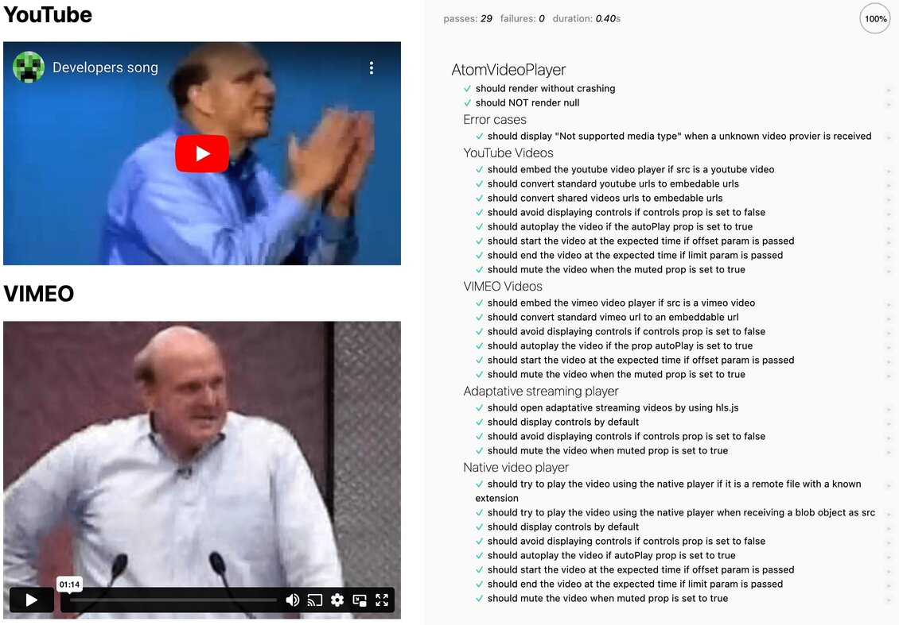

# AtomVideoPlayer

## About this component



This component allows to play any video natively supported by the browser, served over the HLS protocol, or hosted on YouTube or VIMEO.
It offers a unique interface to configure the behaviour and settings of the player, which applies regardless of the video type received on the src parameter.

Thanks to this, is possible to invoke this component any time a video needs to be played with a specific settings, knowing that if it is on the supported formats, it will be likely properly played.

These are the supported video sources:

* Videos served over the HLS adaptative streaming protocol
* Videos hosted on YouTube
* Videos hosted on VIMEO
* File or Blob instances containing a video which the browser is able to natively play it by using the video tag
* Remote urls containing a video that can be natively played by the browser by using the video tag

## Basic usage

### Install the component

```sh
$ npm install @s-ui/react-atom-video-player
```

### Import the component

```js
import AtomVideoPlayer from '@s-ui/react-atom-video-player'

return (<AtomVideoPlayer src="https://www.youtube.com/embed/1gI_HGDgG7c" />)
```

### Import the styles (Sass)

```css
@import '~@s-ui/theme/lib/index';
/* @import 'your theme'; */
@import '~@s-ui/react-atom-video-player/lib/index';
```

## Available properties

The behaviour of the player can be customized by setting the following properties:

| Name | Type | Description | Required? | Default value if not provided |
| --- | --- | --- | --- | --- |
| autoPlay | `true`, `false`, or `'ON_VIEWPORT'` | `false` if the video doesn't need to be autoplayed, `true` if the video needs to be autoplayed once the player is loaded, `'ON_VIEWPORT'` if the video has to be autoplayed once the player fully intersects on the viewport | No | `false` |
| intersectionObserverConfiguration | object | Configuration of the intersection observer used when autoplay is set to `'ON_VIEWPORT'`. This allows the parent component to define when the video will be considered to have intersected on the viewport, and adapt it to specific product needs. | No | `{root: null, rootMargin: '0% 0% -25% 0%', threshold: 1}` |
| controls | boolean | Whether the player controls need to be displayed or not | No | `true` |
| muted | boolean | Whether the player should be muted by default. Please note that it is recommended to set this to true if `autoPlay` prop is different to `false` | No | `false` |
| timeLimit | number | Second after which the video playing will stop. This is intended to play a fragment of the received video | No | undefined |
| timeOffset | number | Second on which the video will start to be played. This is intended to skip a number of seconds from a video and start playing it from a specific position | No | undefined |
| src | string or Blob | Video to be played. It can be a remote URL or a Blob instance (it works with a File instance too, as it is an extension from Blobs) | No | `''` |
| fallbackComponent | Node | A component to be shown while the player and required libraries are being loaded using React lazy | No | `null` |
| onLoadVideo | function | Returns a basic object containing the video duration, video width and video height. NOT SUPPORTED for YouTube videos. | No | `() => null` |

## Other exported objects

The following variables are exported from the component main file, and can be used to configure the component in a more consistent and safer way:

| Name | Description |
| --- | --- |
| `AUTOPLAY` | Contains the existing autoplay modes and can be used to set the autoplay prop in a more safe way |

## Technical considerations

Please have in mind the following technical considerations:

* Some third party libraries are being required by this component to support all video types. More specifically, the official [VIMEO player library](https://github.com/vimeo/player.js) is used to interact and customize the VIMEO embed player, and [HLS.js](https://github.com/video-dev/hls.js) is required to play videos served over the HLS protocol, to ensure it works even if the browser doesn't natively support it.
* Trying to autoplay a video prior of any user interaction with the DOM, and without muting the videoplayer by default, could fail due to some browsers security policies. It is encouraged to always set the `muted` property to `true` when autoplaying videos. Please consider too how autoplaying a non-muted video could negatively affect to the user experience.
* A url containing `yams-hls` will be considered a video server over HLS by Yams (A kind of Adevinta media service). If the video file has the extension `.m3u8` it will be considered an `HLS` video too.