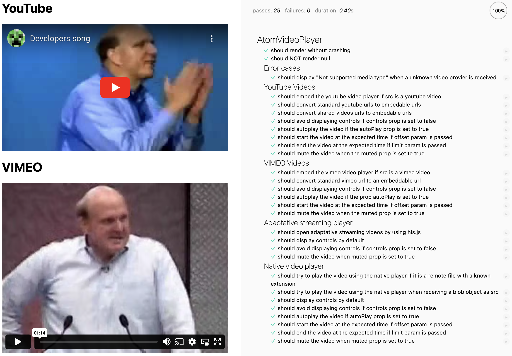

# AtomVideoPlayer

> Description

<!--  -->

## Installation

```sh
$ npm install @s-ui/react-atom-video-player
```

## Usage

### Basic usage

#### Import package and use the component

```js
import AtomVideoPlayer from '@s-ui/react-atom-video-player'

return (<AtomVideoPlayer />)
```

#### Import the styles (Sass)

```css
@import '~@s-ui/theme/lib/index';
/* @import 'your theme'; */
@import '~@s-ui/react-atom-video-player/lib/index';
```


> **Find full description and more examples in the [demo page](#).**