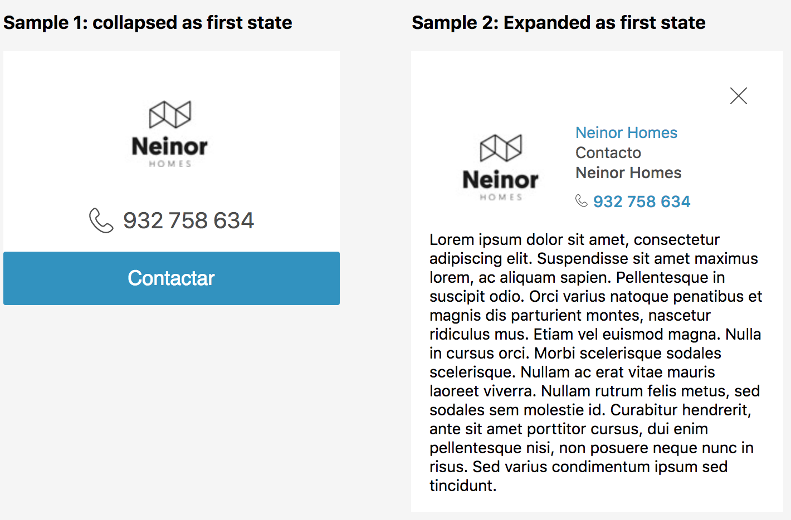

# CardCollapsible

> Description



Displays an expandable/collapsible card, hiding it's content that must be passed to the card's component as its children node until the "expand" action is triggered clicking the corresponding button.

- When the card is collapsed, it displays a header image and a list of additional text info below it, which can be configured through the property `info.displayWhenCollapsed`. It also displays a button that is configured to trigger the "expand" action.

- When the card is expanded, the content will be displayed below, and the card's header will be modified to show the image in the left side, and other additional info will be displayed in the right side of the header, configurable in the property `info.displayWhenExpanded`.

## Installation

```sh
$ npm install @schibstedspain/sui-card-collapsible --save
```

## Usage

### Basic usage
```js
import CardCollapsible from '@schibstedspain/sui-card-collapsible'

return (<CardCollapsible />)
```


> **Find full description and more examples in the [demo page](#).**
